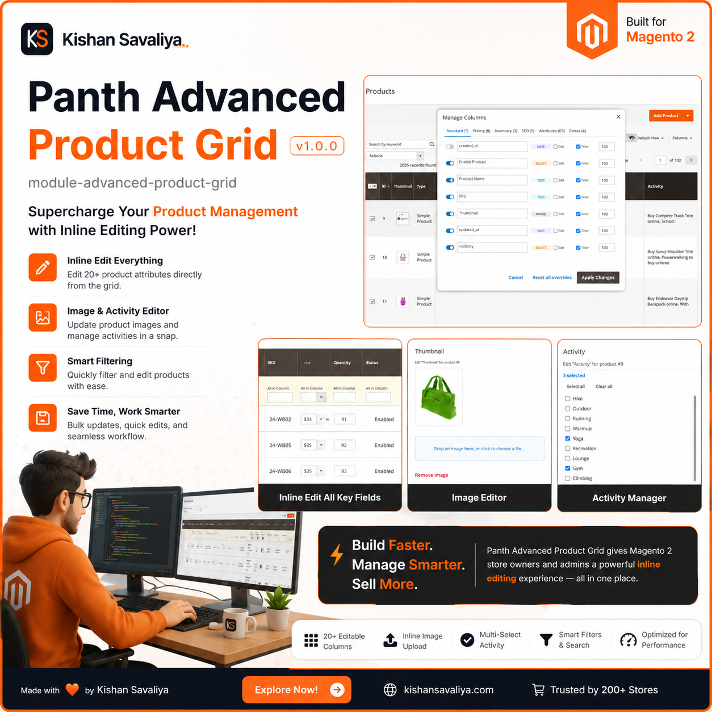
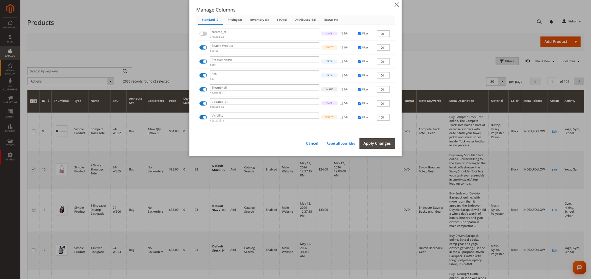
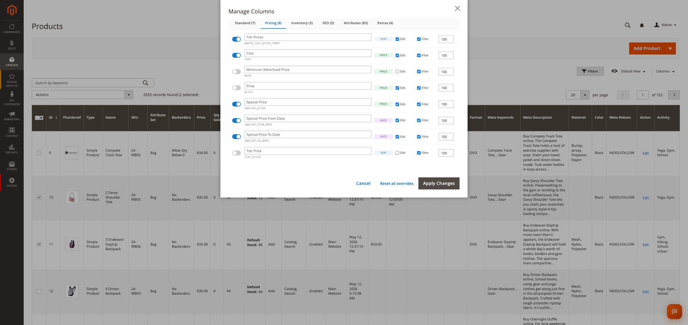
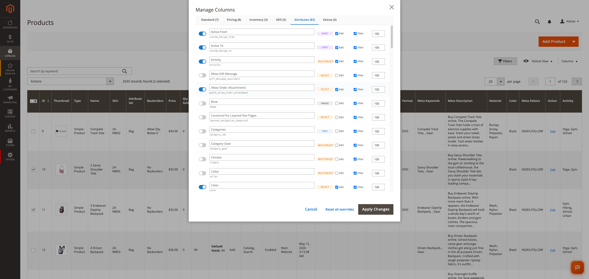
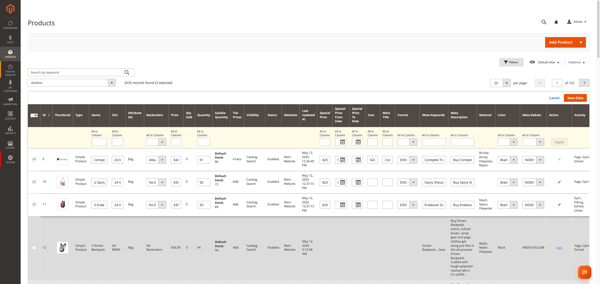
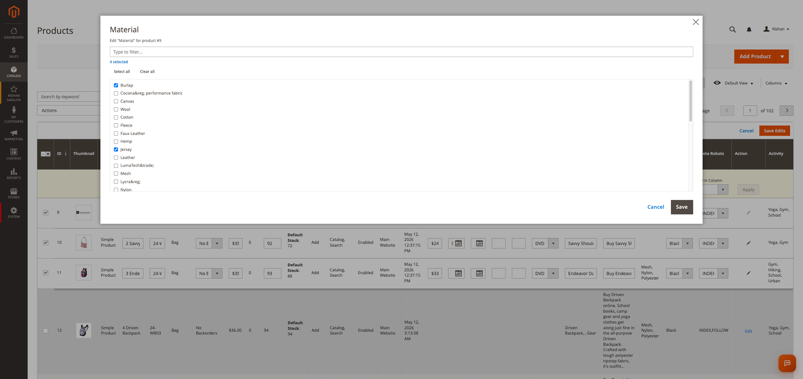
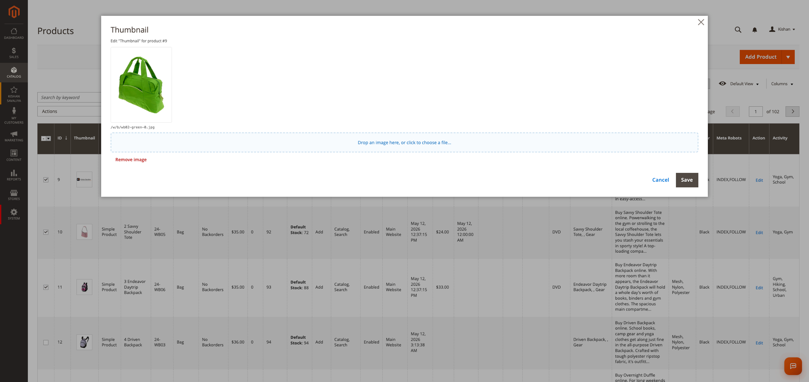
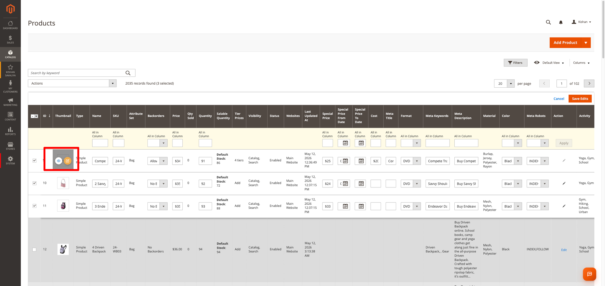
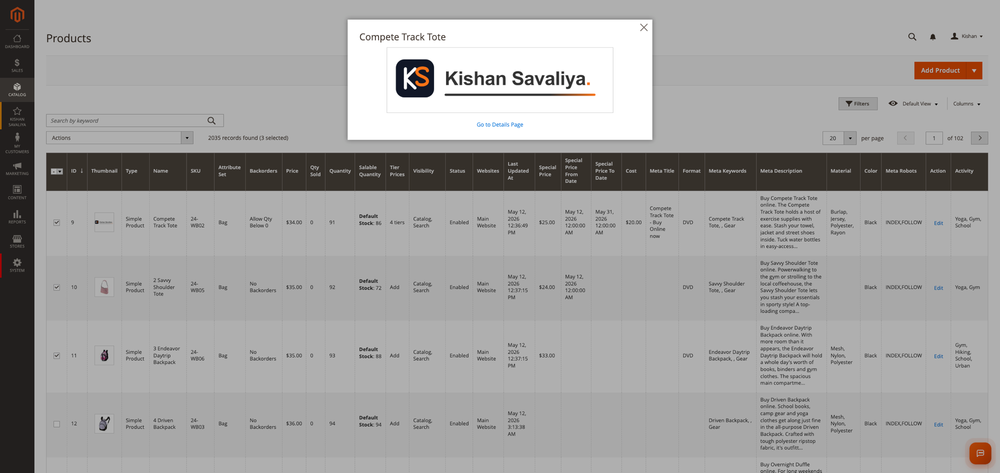
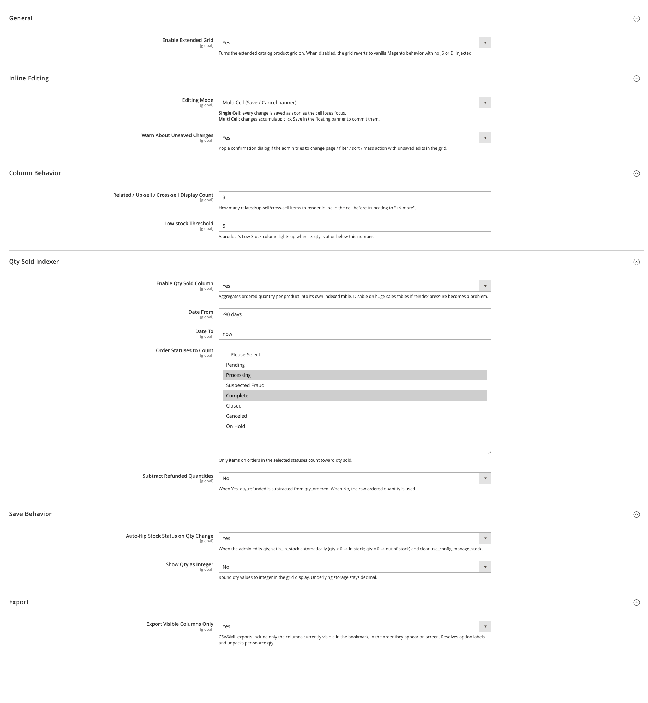

<!-- SEO Meta -->
<!--
  Title: Panth Advanced Product Grid - Inline Edit Magento 2 Admin Catalog Grid | Panth Infotech
  Description: Panth Advanced Product Grid turns Magento 2's admin catalog grid into a spreadsheet — inline-edit every column (text, select, multiselect, date, price, image, tier price), auto-discover EAV attributes, add 20+ extra columns (thumbnail, categories, availability, qty sold, tier prices, storefront URL), tabbed Manage Columns panel with rename / reorder / per-column visibility, smart filters that work on every data type, modal editors for textarea / multiselect / images / tier prices, qty-sold indexer, unsaved-changes guard, and CSV/XML export limited to visible columns. Compatible with Magento 2.4.4 - 2.4.8, PHP 8.1 - 8.4, Hyva and Luma admin themes.
  Keywords: magento 2 advanced product grid, magento 2 inline edit grid, magento 2 mass product edit, magento 2 catalog grid extension, magento 2 column manager, magento 2 grid editor, magento 2 product grid customization, magento 2 spreadsheet editor, magento 2 grid filters, magento 2 EAV grid, magento 2 tier price grid, magento 2 grid export, hyva admin grid, luma admin grid, magento 2 admin productivity
  Author: Kishan Savaliya (Panth Infotech)
  Canonical: https://github.com/mage2sk/module-advanced-product-grid
-->

# Panth Advanced Product Grid — Inline Edit Magento 2 Admin Catalog Grid | Panth Infotech

<p align="center">
  
</p>

[](https://magento.com)
[](https://php.net)
[](https://www.hyva.io)
[](https://packagist.org/packages/mage2kishan/module-advanced-product-grid)
[](https://github.com/mage2sk/module-advanced-product-grid)
[](https://www.upwork.com/freelancers/~016dd1767321100e21)
[](https://www.upwork.com/agencies/1881421506131960778/)
[](https://kishansavaliya.com)

> **Turn the Magento 2 admin catalog grid into a spreadsheet.** Inline-edit every column — text, select, multiselect, date, price, image, tier price — auto-discover every EAV attribute, add 20+ extra columns, manage visibility / rename / reorder / filter from one tabbed panel, and ship a smarter CSV / XML export. Built for catalog managers who live inside the product grid.

**Panth Advanced Product Grid** rewrites the admin product listing experience. Instead of clicking into each product to update one field, your team edits cells **directly in the grid**, applies changes across many rows with **mass edit**, opens **rich modal editors** for textareas / multi-selects / image galleries / tier prices, and **filters by any attribute** — including custom EAV attributes you create tomorrow. The grid auto-discovers attributes from your EAV setup, so you never need to declare a single XML column for new fields, and every save passes through a **per-attribute strategy** that handles category sync, image roles, URL keys, stock, tier prices, and more without losing data.

The module overlays Magento's standard `product_listing` UI component instead of replacing it, so it stays compatible with every other extension that touches the grid (MSI, ConfigurableProduct, Amasty, etc.). Performance is engineered for **2,000+ row stores** with batched queries, an indexed qty-sold table, and a bookmark-aware data provider that only loads the attributes you actually display.

---

## 🚀 Need Custom Magento 2 Development?

> **Get a free quote for your project in 24 hours** — custom modules, Hyva themes, performance optimization, M1→M2 migrations, and Adobe Commerce Cloud.

<p align="center">
  <a href="https://kishansavaliya.com/get-quote">
    
  </a>
</p>

<table>
<tr>
<td width="50%" align="center">

### 🏆 Kishan Savaliya
**Top Rated Plus on Upwork**

[](https://www.upwork.com/freelancers/~016dd1767321100e21)

100% Job Success • 10+ Years Magento Experience
Adobe Certified • Hyva Specialist

</td>
<td width="50%" align="center">

### 🏢 Panth Infotech Agency
**Magento Development Team**

[](https://www.upwork.com/agencies/1881421506131960778/)

Custom Modules • Theme Design • Migrations
Performance • SEO • Adobe Commerce Cloud

</td>
</tr>
</table>

**Visit our website:** [kishansavaliya.com](https://kishansavaliya.com) &nbsp;|&nbsp; **Get a quote:** [kishansavaliya.com/get-quote](https://kishansavaliya.com/get-quote)

---

## See It In Action

<p align="center">
  
</p>

---

## Screenshots

### Manage Columns Panel — tabbed picker with rename, toggles, sort order, filterable / editable / width / marker chips. Opens as a centered popup over the grid.

| Standard tab | Pricing tab | Attributes tab (auto-discovered EAV) |
|:---:|:---:|:---:|
|  |  |  |

### Multi-Cell Inline Edit — pick rows, edit every cell across them, Save Edits banner commits the batch.



### Modal Editors — rich popups for cell types that don't fit inline.

| Multiselect editor (searchable + select-all / clear-all) | Thumbnail / image editor |
|:---:|:---:|
|  |  |

### Image Cell Hover Overlay — "View" jumps to the storefront preview, "Edit" opens the upload modal.

| Hover state | Storefront preview modal |
|:---:|:---:|
|  |  |

### System Configuration — every behavior of the grid is configurable from one place.



---

## Table of Contents

- [Key Features](#key-features)
- [Why Inline-Edit Matters](#why-inline-edit-matters)
- [Compatibility](#compatibility)
- [Installation](#installation)
- [Configuration](#configuration)
- [Extra Columns Reference](#extra-columns-reference)
- [Inline Edit Strategies](#inline-edit-strategies)
- [Manage Columns Panel](#manage-columns-panel)
- [Smart Filters](#smart-filters)
- [Export Behavior](#export-behavior)
- [Architecture](#architecture)
- [ACL & Permissions](#acl--permissions)
- [Troubleshooting](#troubleshooting)
- [FAQ](#faq)
- [Support](#support)
- [About Panth Infotech](#about-panth-infotech)
- [Quick Links](#quick-links)

---

## Key Features

### Inline Edit Every Column

- **Text / number / URL key / SKU** — type and tab between cells, just like a spreadsheet
- **Select / Yes-No** — dropdown that resolves option labels (including option values containing commas, e.g. `INDEX,FOLLOW`)
- **Multiselect** — searchable modal with checkboxes and clear-all
- **Date / datetime** — calendar picker with locale-aware formatting
- **Price / cost / special price / weight** — plain numeric input (no `$` prefix in the editor)
- **Textarea** — full-height modal editor instead of a cramped inline field
- **Image (base / small / thumbnail / swatch)** — modal with upload, preview, and "view on storefront" link
- **Tier price** — full modal with website + customer-group scoping
- **Multi-row mass edit** — banner-based Save / Cancel for editing multiple rows at once

### Auto-Discover EAV Attributes

- Every product attribute flagged `is_used_in_grid = 1` shows up automatically
- Brand-new attributes you enable via the **Columns** panel get a real UI component (filter, options, editor) created on the fly
- The `AttributeSetAssigner` quietly attaches an attribute to a product's set on first inline edit, so writes never silently no-op at the EAV layer

### 20+ Extra Columns

| Column | What it shows |
|---|---|
| Thumbnail | Product image with hover overlay (View / Edit) |
| Categories | Colored chips per category with a quick "remove from category" link |
| Type | Bag, Top, Bottom, Configurable, Bundle, Downloadable, etc. |
| Attribute Set | Set name (not just ID) |
| Visibility | Catalog, Search, Catalog+Search, Not Visible |
| Availability | Tri-state — In Stock / Out of Stock / Manage Stock Disabled |
| Backorders | No Backorders / Allow Qty Below 0 / Allow Qty Below 0 + Notify |
| Low Stock | Boolean derived from a configurable threshold |
| Quantity | Editable, with optional integer-only display |
| Salable Quantity | Per-source breakdown when MSI is installed |
| Special Price From / To | Editable date range |
| Cost | Editable numeric |
| Tier Prices | Count chip ("4 tiers") that opens a full tier-price modal |
| Qty Sold | Indexed total over a configurable date range and order-status set |
| Storefront URL | Click-through link to the live product page |
| Meta Title / Keywords / Description / Robots | Full SEO column set, editable inline |

### Tabbed Manage Columns Panel

- Five tabs — **Standard**, **Pricing**, **Inventory**, **SEO**, **Attributes**, **Extras**
- Per-column toggles: **Visible**, **Editable**, **Filterable**, **In Export**, sort order
- Inline rename — set a custom label per column without touching XML
- Drag-and-drop reorder that persists into the bookmark
- "Reset all overrides" button to wipe per-column customizations in one click

### Smart Filters for Every Data Type

- **Text / textarea** → substring match
- **Select / boolean** → dropdown of option labels
- **Multiselect** → automatic `FIND_IN_SET` lookup so picking one option matches rows storing many
- **Date / datetime** → date-range picker
- **Price / weight / quantity** → from/to numeric range
- **Custom virtual filters** — Categories ("No Categories" sentinel), Availability (manage-stock aware), Qty Sold range, Thumbnail (added / missing)

### Performance Engineering

- **Bookmark-aware select** — the data provider walks the user's current bookmark and only loads the EAV attributes that are actually visible
- **Batched queries** — categories, stock, tier prices, qty sold, and image data are loaded in single queries keyed by the page's row IDs (never row-by-row)
- **Indexed qty sold** — `panth_product_grid_qty_sold` mview keeps a denormalized total
- **Constructor-only DI** — zero ObjectManager calls, MEQP-compliant

### Unsaved-Changes Guard

- Every grid navigation (paging, sizes, sorting, filtering, mass actions, exports, bookmarks) checks for in-progress edits and prompts before discarding them
- Synchronous fast-path when nothing is dirty so the grid never feels laggy

### Export Aware of Visible Columns

- CSV / XML export respects the bookmark's column order and visibility
- Option labels are resolved (no raw `12,34,56` in the output)
- Per-column "In Export" toggle in the Manage Columns panel

---

## Why Inline-Edit Matters

Catalog managers spend hours every week opening, editing, and saving products one at a time. The native Magento grid only allows editing a handful of fields, and only for the columns Magento decided to make editable. Anything custom requires going into the product edit form, scrolling, saving, waiting for cache, going back.

Panth Advanced Product Grid removes that friction:

1. **One screen, one save** — edit ten cells across five products, hit Save Edits once
2. **No XML for new attributes** — create a custom attribute, enable it in Columns, edit it
3. **No silent failures** — saves verify against the DB; if EAV drops a write, you see a clear error instead of an empty cell
4. **Fewer mistakes** — filters narrow the grid to exactly the rows you intend to touch, so bulk edits stay safe

---

## Compatibility

| Requirement | Versions Supported |
|---|---|
| Magento Open Source | 2.4.4, 2.4.5, 2.4.6, 2.4.7, 2.4.8 |
| Adobe Commerce | 2.4.4, 2.4.5, 2.4.6, 2.4.7, 2.4.8 |
| Adobe Commerce Cloud | 2.4.4 — 2.4.8 |
| PHP | 8.1.x, 8.2.x, 8.3.x, 8.4.x |
| MySQL | 8.0+ |
| MariaDB | 10.4+ |
| Hyva Admin | 1.0+ (native support) |
| Luma Admin | Native support |
| Required Dependency | `mage2kishan/module-core` ^1.0 |
| Optional | `magento/module-inventory-api`, `magento/module-configurable-product` |

---

## Installation

### Composer Installation (Recommended)

```bash
composer require mage2kishan/module-advanced-product-grid
bin/magento module:enable Panth_Core Panth_AdvancedProductGrid
bin/magento setup:upgrade
bin/magento setup:di:compile
bin/magento setup:static-content:deploy -f
bin/magento cache:flush
bin/magento indexer:reindex panth_product_grid_qty_sold
```

### Manual Installation via ZIP

1. Download the latest release ZIP from [Packagist](https://packagist.org/packages/mage2kishan/module-advanced-product-grid) or the [Adobe Commerce Marketplace](https://commercemarketplace.adobe.com)
2. Extract the contents to `app/code/Panth/AdvancedProductGrid/` in your Magento installation
3. Ensure `Panth_Core` is installed (required dependency)
4. Run the same commands as above starting from `bin/magento module:enable`

### Verify Installation

```bash
bin/magento module:status Panth_AdvancedProductGrid
# Expected output: Module is enabled
```

---

## Configuration

Navigate to **Admin → Stores → Configuration → Panth Extensions → Product Grid** to configure the module.

| Setting | Default | Description |
|---|---|---|
| Enable | Yes | Master toggle — when off, the grid reverts to standard Magento behavior. |
| Editing Mode | Multi Cell | Single Cell (save on blur) or Multi Cell (Save / Cancel banner). |
| Confirm on Navigation | Yes | Prompt before discarding pending edits when paging / filtering / sorting. |
| Linked Products Qty | 3 | How many related / upsell / cross-sell SKUs to preview in the cell. |
| Low Stock Threshold | 5 | Qty at or below which a product is marked low-stock. |
| Qty Sold Enabled | Yes | Master switch for the qty-sold indexer. |
| Qty Sold Date From | -90 days | Strtotime-style anchor for the rolling window. |
| Qty Sold Date To | now | End of the rolling window. |
| Qty Sold Order Statuses | complete, processing | Which order statuses count toward qty sold. |
| Qty Sold Include Refunded | No | Whether to subtract refunded units. |
| Auto-flip Stock on Qty Change | Yes | Setting qty to 0 marks the product out of stock automatically. |
| Show Qty as Integer | No | Round qty for display; storage stays decimal. |
| Export Visible Columns Only | Yes | CSV/XML export honors the bookmark's visible columns. |

---

## Extra Columns Reference

### Thumbnail
Renders the product's base image (or `small_image` / `thumbnail` / `swatch_image` if available) with a hover overlay that exposes **View** (storefront link) and **Edit** (modal upload) actions.

### Categories
Colored chips, one per assigned category, with the full path resolved (e.g. `Bags › Travel › Duffles`). Click a chip × to remove the category from the product directly from the grid.

### Availability
A tri-state derived from `manage_stock`, `use_config_manage_stock`, and `is_in_stock`:
- **In Stock** — manage_stock=1 and is_in_stock=1
- **Out of Stock** — manage_stock=1 and is_in_stock=0
- **Manage Stock Disabled** — manage_stock=0 (always considered available)

### Backorders
Standard `backorders` attribute exposed as a select column with editable options: No Backorders / Allow Qty Below 0 / Allow Qty Below 0 and Notify Customer.

### Low Stock
Boolean derived from the configurable threshold. Quick filter to surface near-empty SKUs without writing a report.

### Qty Sold (Indexed)
Total units sold over the configured window. Uses an mview-indexed table (`panth_product_grid_qty_sold`) — even on stores with hundreds of thousands of orders the column loads in milliseconds.

### Storefront URL
Computed `<base>/<url_key>` link that opens in a new tab. Resolves correctly under multi-store and category-aware URL setups.

### Tier Prices
Shows the count of active tier-price rows ("4 tiers"). Clicking opens a modal where the admin can add / remove tiers, switch between **Fixed Price** and **Discount Percentage**, and assign each tier to a specific website + customer group.

---

## Inline Edit Strategies

Each attribute type routes through a dedicated strategy class in `Model/InlineEdit/Strategy/`:

| Attribute | Strategy | What it handles |
|---|---|---|
| `qty` | `QtyStrategy` | Writes to stock_item, auto-flips `is_in_stock` based on config. |
| `category_ids` | `CategoryIdsStrategy` | Diff-based add + remove via `CategoryLinkManagementInterface`. |
| `tier_price` | `TierPriceStrategy` | Normalizes website + group + price + qty payload. |
| `weight` | `WeightStrategy` | Numeric validation, strips currency / commas. |
| `visibility` | `VisibilityStrategy` | Validates against the 4 standard visibility states. |
| `url_key` | `UrlKeyStrategy` | Generates URL rewrites + handles duplicates. |
| `panth_availability` | `AvailabilityStrategy` | Translates the tri-state back into stock_item fields. |
| `panth_backorders` | `BackordersStrategy` | Updates the standard `backorders` value. |
| `image / small_image / thumbnail / swatch_image` | `ImageRoleStrategy` | Direct DB inserts into the media gallery tables (bypasses the noisy product-save validator). |
| Everything else | `GenericAttributeStrategy` | Plain `setData` with `__empty__` / `__use_default__` sentinels. |

All saves go through `Model/InlineEdit/Processor` which:
1. Force-reloads the product in edit mode (so every EAV attribute is in `_origData` and writes always persist).
2. Calls `AttributeSetAssigner` to ensure the attribute is bound to the product's set.
3. Dispatches to the right strategy.
4. Saves via the standard `ProductRepository`.
5. Verifies, then optionally refreshes URL rewrites.

---

## Manage Columns Panel

Click the **Columns** button (top-right of the grid) to open the centered popup. Inside:

- **Tabs** group columns into Standard, Pricing, Inventory, SEO, Attributes, Extras.
- **Toggle switch** on the left controls visibility.
- **Text input** lets you rename the column (e.g. rename "manufacturer" to "Brand").
- **Type badge** shows the data type (text / select / multiselect / date / price / image / textarea).
- **Edit / Filter / Sort Order / Width / Marker Color** chips control per-column behavior.
- **Apply Changes** persists overrides into `panth_product_grid_column_config` and reloads the grid.
- **Reset all overrides** clears every saved customization in one click.

Double-clicking a column header in the grid also opens a quick-rename prompt for that single column.

---

## Smart Filters

Filtering works automatically for every column the data provider knows about:

- The filter UI rewrites condition types based on the underlying EAV `frontend_input` so multiselect attributes use `FIND_IN_SET` (otherwise picking "Red" on a multi-color attribute would never match rows storing `12,34,57`).
- Custom virtual filters add features Magento doesn't ship with: `panth_categories` (with a "No Categories" sentinel), `panth_availability` (manage-stock aware), `panth_qty_sold` (numeric range), `panth_thumbnail` (added / missing).
- All filters honor the column's `Filterable` toggle in the Manage Columns panel — turn it off to hide the filter from the toolbar.

---

## Export Behavior

When **Export Visible Columns Only** is enabled (default), CSV / XML exports:

- Include only the columns currently visible in the user's bookmark
- Preserve the visual column order
- Resolve option labels (so an `INDEX,FOLLOW` value exports as `INDEX,FOLLOW`, not `15`)
- Honor the per-column **In Export** toggle so you can hide internal-only columns from the file

Disable the toggle in Stores → Configuration to fall back to Magento's stock export behavior.

---

## Architecture

```
Magento product_listing UI overlay
 ├─ Ui/Component/Listing/Columns         ← extends Magento_Ui Columns, auto-discovers EAV attributes
 ├─ Ui/Component/Listing/ColumnFactory   ← builds a Column from an attribute (type, filter, options, editor)
 ├─ Ui/Component/Listing/AttributeRepository ← caches is_used_in_grid attributes + on-demand lookups
 ├─ Plugin/Catalog/Ui/DataProvider/
 │    ProductDataProviderPlugin          ← bookmark-aware addAttributeToSelect + row enrichment
 │    ProductDataProviderFilterPlugin    ← rewrites condition types per frontend_input
 └─ Model/InlineEdit/
      Processor                          ← per-product save loop
      StrategyResolver                   ← attribute_code → strategy
      AttributeSetAssigner               ← auto-binds attribute to product's set
      Strategy/*                         ← one class per non-trivial attribute

view/adminhtml/
 ├─ ui_component/product_listing.xml     ← overlay (no class replacement on existing columns)
 ├─ templates/rename-header-init.phtml   ← inline JS bootstrap for Manage Columns + popup editors
 ├─ web/js/mixin/*-mixin.js              ← Magento UI mixins for unsaved-changes guard
 └─ web/js/grid/columns/select-no-split.js ← legacy fallback for old browsers
```

- All cross-module integrations (MSI, ConfigurableProduct) are guarded by `isTableExists()` / module-list checks — disabling sibling modules is safe.
- The qty-sold mview subscription auto-switches to the sales DB connection on split-DB deployments via `Plugin/Mview/SalesConnectionPlugin`.
- Every controller is gated by an ACL resource (see below).

---

## ACL & Permissions

| Resource | Purpose |
|---|---|
| `Panth_AdvancedProductGrid::product_grid` | Top-level resource — gate the whole grid feature. |
| `Panth_AdvancedProductGrid::inline_edit` | Required to save inline cell edits. |
| `Panth_AdvancedProductGrid::tier_price` | Required to open the tier-price modal. |
| `Panth_AdvancedProductGrid::manage_gallery` | Required to open the image-role modal. |
| `Panth_AdvancedProductGrid::config` | Required to access System Config → Product Grid. |

Use these in **System → User Roles** to give catalog managers exactly the privileges they need without giving away the whole admin.

---

## Troubleshooting

| Issue | Cause | Resolution |
|---|---|---|
| Custom attribute cell shows empty after save | Attribute not in product's attribute set | `AttributeSetAssigner` now handles this on save automatically; if you still see it, re-flush cache. |
| Filter chip shows but row count doesn't change | Stale cache after upgrade | Run `bin/magento cache:flush` and hard-refresh the admin (Cmd/Ctrl+Shift+R). |
| Save Edits button stays disabled | No actual change in any cell | Touch a cell value — the button enables once at least one field is dirty. |
| Price input shows `$` prefix | Theme override re-introduced the price editor | Confirm `setup:static-content:deploy -f` re-ran after install. |
| Grid 404s on render | Inventory-Sales-Admin-Ui `maximumStocksToShow` DI bug | Run `bin/magento setup:di:compile` again after `cache:clean config`. |
| Manage Columns popup off-center | Stale compiled `styles.css` | Run a full static deploy without `--no-css`. |

---

## FAQ

### Does it replace Magento's stock product grid?
No — it overlays it. The standard `product_listing.xml` and `ProductDataProvider` stay in place; the module adds columns and plugins. Disabling the module reverts to the native grid with zero data loss.

### Will it conflict with MSI or ConfigurableProduct?
No. All integrations are guarded by `isTableExists()` and module-list checks. MSI per-source columns appear when MSI is installed; the Parent SKU column appears when ConfigurableProduct is installed.

### Can I edit a brand-new attribute I just created?
Yes. Enable it in the **Columns** panel and the column appears with a filter, an editor, and option labels. On first save, `AttributeSetAssigner` auto-binds the attribute to the product's set so the write persists.

### Is it Hyva-compatible?
Yes. The module is admin-only (front-end stores aren't affected). The admin grid runs on Magento's stock UI components, which Hyva inherits.

### Can I customize the column editor type for a specific attribute?
Yes. Use **Manage Columns → Edit chip** to toggle inline edit on/off per column. For richer customization, override `ColumnFactory::EDITOR_TYPE_BY_INPUT` via class preference.

### Does it support multi-store / multi-language?
Yes. All UI strings are translatable via `__()`. Per-store edits use the standard Magento store scope.

### Are inline edits ACL-gated?
Yes. Every save controller checks `Panth_AdvancedProductGrid::inline_edit` and individual modals check their own resources.

### Is Panth_Core required?
Yes. `mage2kishan/module-core` is a required dependency and is pulled in automatically by Composer. It provides shared services (config helpers, install reporter, system messages).

### How does the qty-sold indexer work?
`Model/Indexer/QtySold` walks `sales_order_item` over the configured date range and statuses, sums qty_ordered minus qty_refunded (if enabled), and writes to `panth_product_grid_qty_sold`. The mview observer keeps it incrementally up-to-date after each order save.

---

## Support

| Channel | Contact |
|---|---|
| Email | kishansavaliyakb@gmail.com |
| Website | [kishansavaliya.com](https://kishansavaliya.com) |
| WhatsApp | +91 84012 70422 |
| GitHub Issues | [github.com/mage2sk/module-advanced-product-grid/issues](https://github.com/mage2sk/module-advanced-product-grid/issues) |
| Upwork (Top Rated Plus) | [Hire Kishan Savaliya](https://www.upwork.com/freelancers/~016dd1767321100e21) |
| Upwork Agency | [Panth Infotech](https://www.upwork.com/agencies/1881421506131960778/) |

Response time: 1-2 business days.

### 💼 Need Custom Magento Development?

Looking for **custom Magento module development**, **Hyva theme customization**, **store migrations**, or **performance optimization**? Get a free quote in 24 hours:

<p align="center">
  <a href="https://kishansavaliya.com/get-quote">
    
  </a>
</p>

<p align="center">
  <a href="https://www.upwork.com/freelancers/~016dd1767321100e21">
    
  </a>
  &nbsp;&nbsp;
  <a href="https://www.upwork.com/agencies/1881421506131960778/">
    
  </a>
  &nbsp;&nbsp;
  <a href="https://kishansavaliya.com">
    
  </a>
</p>

**Specializations:**

- 🛒 **Magento 2 Module Development** — custom extensions following MEQP standards
- 🎨 **Hyva Theme Development** — Alpine.js + Tailwind CSS, lightning-fast storefronts
- 🖌️ **Luma Theme Customization** — pixel-perfect designs, responsive layouts
- ⚡ **Performance Optimization** — Core Web Vitals, page speed, caching strategies
- 🔍 **Magento SEO** — structured data, hreflang, sitemaps, AI-generated meta
- 🛍️ **Checkout Optimization** — one-page checkout, conversion rate optimization
- 🚀 **M1 to M2 Migrations** — data migration, custom feature porting
- ☁️ **Adobe Commerce Cloud** — deployment, CI/CD, performance tuning
- 🔌 **Third-party Integrations** — payment gateways, ERP, CRM, marketing tools

---

## License

Panth Advanced Product Grid is licensed under a proprietary license — see `LICENSE.txt`. One license per Magento installation.

---

## About Panth Infotech

Built and maintained by **Kishan Savaliya** — [kishansavaliya.com](https://kishansavaliya.com) — a **Top Rated Plus** Magento developer on Upwork with 10+ years of eCommerce experience.

**Panth Infotech** is a Magento 2 development agency specializing in high-quality, security-focused extensions and themes for both Hyva and Luma storefronts. Our extension suite covers SEO, performance, checkout, product presentation, customer engagement, and store management — over 34 modules built to MEQP standards and tested across Magento 2.4.4 to 2.4.8.

Browse the full extension catalog on the [Adobe Commerce Marketplace](https://commercemarketplace.adobe.com) or [Packagist](https://packagist.org/packages/mage2kishan/).

### Quick Links

- 🌐 **Website:** [kishansavaliya.com](https://kishansavaliya.com)
- 💬 **Get a Quote:** [kishansavaliya.com/get-quote](https://kishansavaliya.com/get-quote)
- 👨‍💻 **Upwork Profile (Top Rated Plus):** [upwork.com/freelancers/~016dd1767321100e21](https://www.upwork.com/freelancers/~016dd1767321100e21)
- 🏢 **Upwork Agency:** [upwork.com/agencies/1881421506131960778](https://www.upwork.com/agencies/1881421506131960778/)
- 📦 **Packagist:** [packagist.org/packages/mage2kishan/module-advanced-product-grid](https://packagist.org/packages/mage2kishan/module-advanced-product-grid)
- 🐙 **GitHub:** [github.com/mage2sk/module-advanced-product-grid](https://github.com/mage2sk/module-advanced-product-grid)
- 🛒 **Adobe Marketplace:** [commercemarketplace.adobe.com](https://commercemarketplace.adobe.com)
- 📧 **Email:** kishansavaliyakb@gmail.com
- 📱 **WhatsApp:** +91 84012 70422

---

<p align="center">
  <strong>Ready to turn your admin product grid into a spreadsheet?</strong><br/>
  <a href="https://kishansavaliya.com/get-quote">
    
  </a>
</p>

---

**SEO Keywords:** magento 2 advanced product grid, magento 2 inline edit grid, magento 2 mass product edit, magento 2 catalog grid extension, magento 2 column manager, magento 2 grid editor, magento 2 product grid customization, magento 2 spreadsheet editor, magento 2 grid filters, magento 2 EAV grid, magento 2 tier price grid, magento 2 grid export, magento 2 multi-cell editor, magento 2 product grid columns, magento 2 product attributes grid, magento 2 admin productivity, magento 2 attribute set grid, magento 2 categories grid, magento 2 thumbnail grid, magento 2 qty sold indexer, magento 2 stock grid, magento 2 availability grid, magento 2 backorders grid, magento 2 low stock grid, magento 2 salable qty grid, magento 2 MSI grid, magento 2 SEO meta grid, magento 2 meta robots grid, hyva admin grid, luma admin grid, magento 2.4.8 admin grid, magento 2 PHP 8.4 grid, mage2kishan advanced product grid, panth infotech product grid, kishan savaliya magento, hire magento developer upwork, top rated plus magento freelancer, custom magento development, adobe commerce admin grid, magento 2 grid plugin
